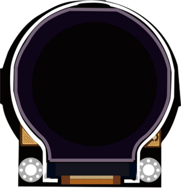
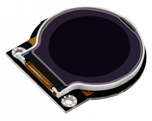
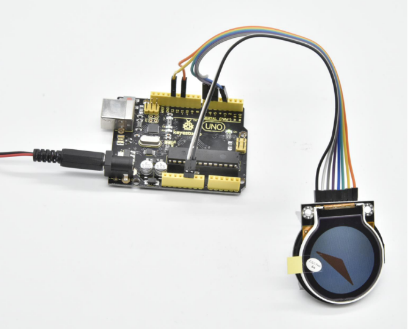

# KS0454 keyestudio Circular TFT LCD Smart Watch Display Module



## 1. Overview

Keyestudio Circular TFT LCD is a 1.6-inch TFT liquid crystal display module. Its input voltage is 3.3V~-5.5V. It can display colored patterns and text.

The fastest LCD refresh on the module is about 256MS, which can realize multiple pattern loop display, and dynamic display effect.

Currently, 19 common colors are defined in the library, and users can also customize 16-bit color codes.

During the experiment, we set the coordinates to the coordinate center of the display, and the maximum absolute value of the positive and negative half axes is 64.

In order to fix on other devices, the module comes with 2 positioning holes with a diameter of 3mm.

**Special Note:**

The parameter 1.6" is marked according to the screen specifications provided by the screen supplier. The actual display area is approximately 1.26" (32mm in diameter).



## 2. Technical Details

- Working voltage: DC 3.3V-5.5V
- Working current: 50MA
- Maximum power: 0.5W
- Resolution：128*RGB*128
- Operating temperature range: -25～+60℃
- Interface: 8pin header (2.54mm pitch)
- Fixing hole diameter: 3mm
- Dimensions: 47mm * 44mm * 6mm
- Weight: 13.3g
- Environmental attributes: ROHS

## 3. PINOUTS

| **PINS** | **Description**                  |
| -------- | -------------------------------- |
| GND      | power negative                   |
| VCC      | power positive                   |
| LCK      | LCD internal register clock line |
| RS       | LCD internal register selection  |
| CS       | Chip select signal               |
| WR       | LCD data input                   |
| SPI-SCL  | Clock signal                     |
| SPI-MOSI | Main device data output          |

## 4. Connection


## 4. Test Code

Download Resource : [Resource](./Resource.7z)

Note： before uploading the code, you need to import the library files; otherwise, the code upload will fail.

```c
#include "DFRobot_ST7687S_Latch.h"
#ifdef __AVR__
uint8_t pin_cs = 3, pin_rs = 5, pin_wr = 6, pin_lck = 7;
#else
uint8_t pin_cs = D3, pin_rs = D5, pin_wr = D6, pin_lck = D7;
#endif

DFRobot_ST7687S_Latch tft(pin_cs, pin_rs, pin_wr, pin_lck);

void setup(void)
{
  tft.begin();
  tft.fillScreen(DISPLAY_WHITE);
}

void loop(void)
{
  tft.drawTriangle(-20, -50, 0, 0, 50, 20, DISPLAY_ORANGE);  //draw triangle
  delay(1000);
  tft.fillTriangle(-20, -50, 0, 0, 50, 20, DISPLAY_ORANGE);  //fill triangle with color
  delay(1000);
  tft.fillScreen(DISPLAY_WHITE);
}
```

**Debugging method:**

- **1.Adjust the color:**

currently define 19 commonly used colors, so you can direct to change the color name.

For example: change the display color ORANGE into GREEN.

Just change tft.drawTriangle(-20, -50, 0, 0, 50, 20, DISPLAY_ORANGE);

into tft.drawTriangle(-20, -50, 0, 0, 50, 20, DISPLAY_GREEN);

We can also define the 4-bit hexadecimal or decimal **(0~65535)** color code to change the background color of the screen.

**Note:** refer to the Hexadecimal color code; not all colors can be displayed.

Like change tft.drawTriangle(-20, -50, 0, 0, 50, 20, 0x000099FF);

into tft.drawTriangle(-20, -50, 0, 0, 50, 20, 39423);

Convert hexadecimal number into decimal number, in the range of 0~65535, can display the corresponding color.

- **2.Set the pattern:**

The coordinates are based on the center of the display, and the absolute value of the positive and negative half axes is 64.

tft.drawTriangle(-20, -50, 0, 0, 50, 20, DISPLAY_ORANGE);

In the code, draw a triangle with vertices of (-20, -50), (0, 0), (50, 20).

## 5. Test Result

Done uploading the code, TFT LCD will display the pattern. In the code, draw a triangle with vertices of (-20, -50), (0, 0), (50, 20), with orange border, and fill it with orange.

